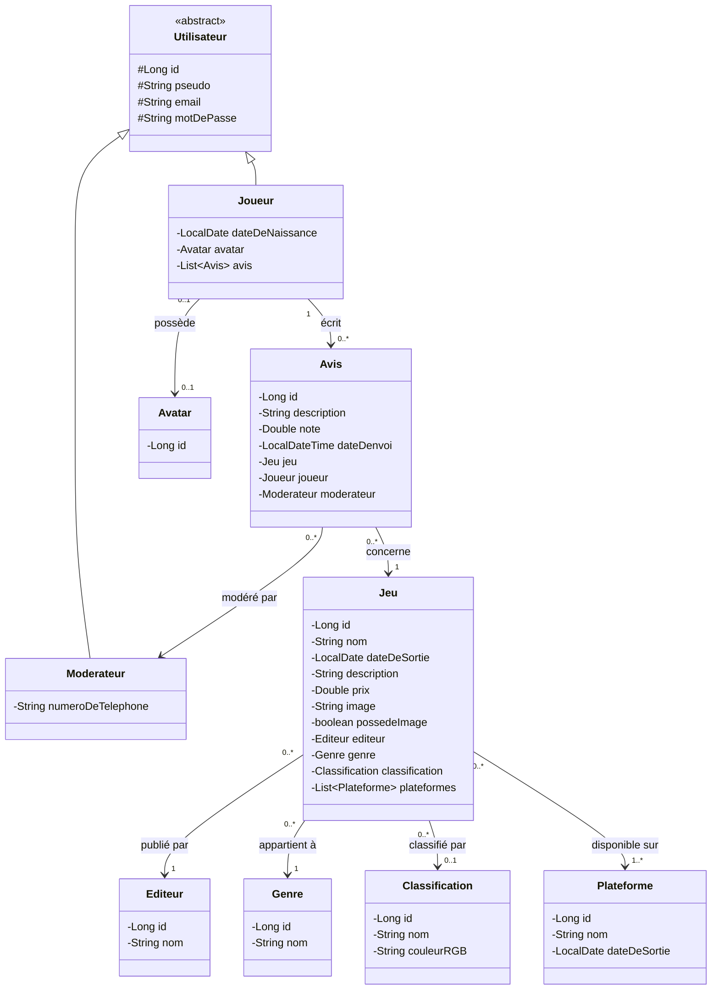
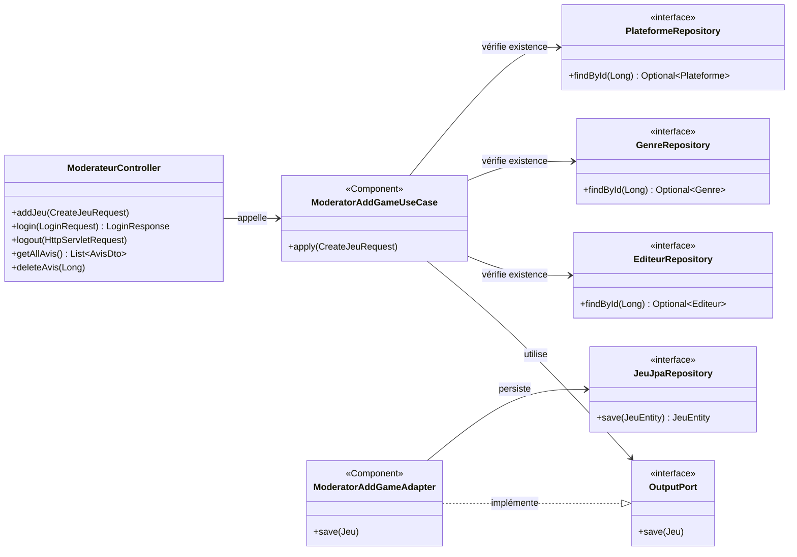
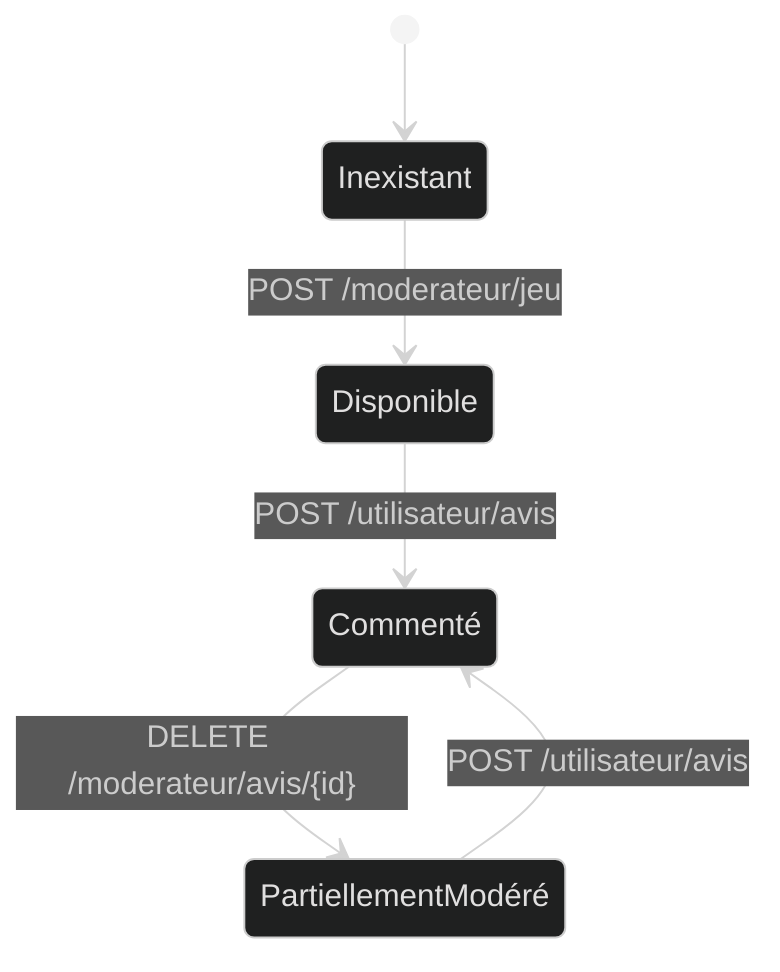
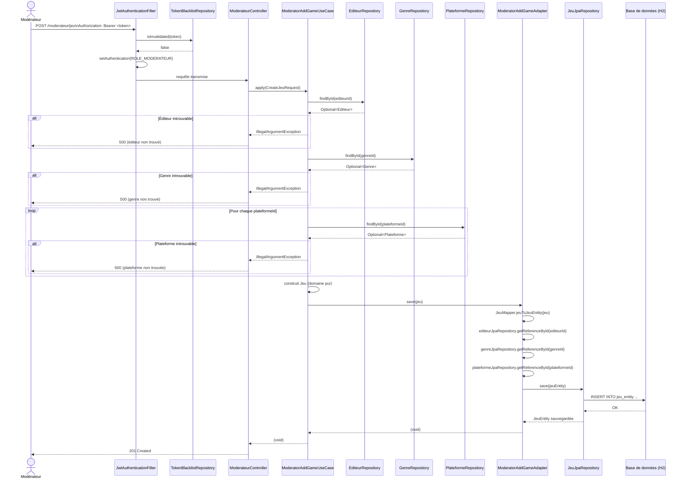

# Modélisation UML

## 1. Diagramme de classes (modèle domaine)

---

## 2. Diagramme de classes (couches techniques)

---

## 3. Diagramme état-transition : cycle de vie d'un Jeu

Un jeu possède deux états observables selon la présence ou non d'avis.

**Explication des états :**

| État | Description |
|------|-------------|
| **Disponible** | Le jeu existe en base, visible via `GET /utilisateur/jeu`, aucun avis associé |
| **Commenté** | Le jeu possède au moins un avis, visible via `GET /utilisateur/avis` |

**Transitions :**

| De | Vers | Déclencheur |
|----|------|-------------|
| *(initial)* | Disponible | `POST /moderateur/jeu` |
| Disponible | Commenté | `POST /utilisateur/avis` |
| Commenté | Commenté | `POST /utilisateur/avis` ou `DELETE /moderateur/avis/{id}` (s'il reste des avis) |
| Commenté | Disponible | `DELETE /moderateur/avis/{id}` (suppression du dernier avis) |

---

## 4. Diagramme de séquence : Use Case "Ajouter un jeu"

